# Backup erstellen & wiederherstellen

Backups werden via der WebUI  erstellt und oder konfiguriert wie automatische Backups zu einem gewissen Zeitpunkt.

###### Speicherort

* Backups werden auf der Festplatte auf der gleichen Maschine und auf einen Externen USB Stick Gepeichert
  * Der USB Stick hat 8 GB Speicherplatz
* Der USB  Stick muss aber dafür aktiv ge-mounted werden via `mount /dev/sdg1 /mnt/stick`
* Falls der USB stick nicht ge-mounted sein sollte, werden die Backups dennoch auf die Festplatte auf den gleichen Mount Point gespeichert.
  * Das Speichern ist auf dem Mountpoint somit leider nicht optimal, und daher empfehlen wir es via eines NFS Shares extern zu speichern.
  * Es Funktioniert nur soweit da wir in Proxmox ein Share als Directory angeben und dadurch ein Pfad local auf der platte genommen wird.

1. Container auswählen und zu Backup gehen

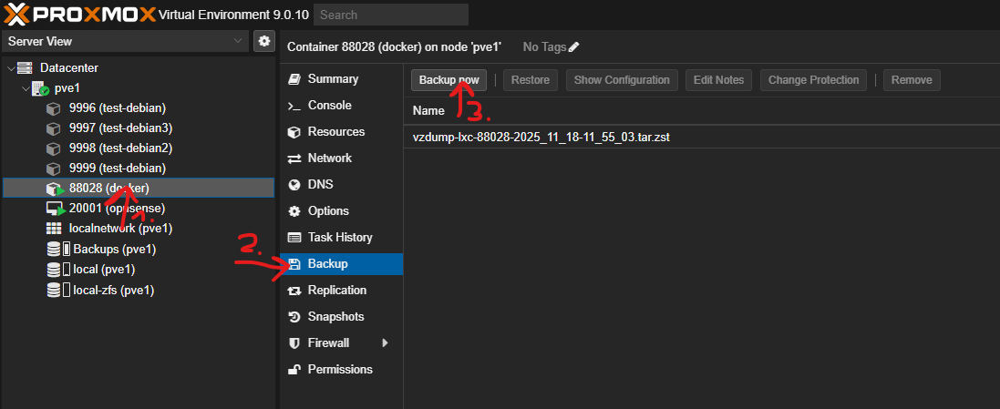

1. Eingabe Notes zur Identifizierung des Backups

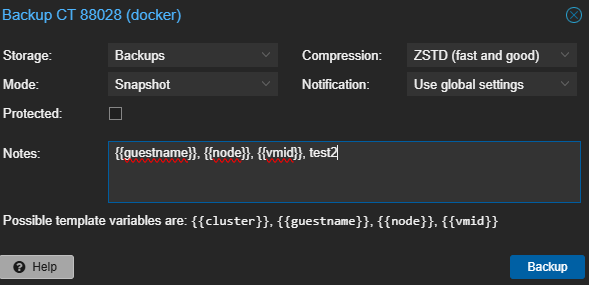

1. Backup erfolgreich wenn "TASK OK"

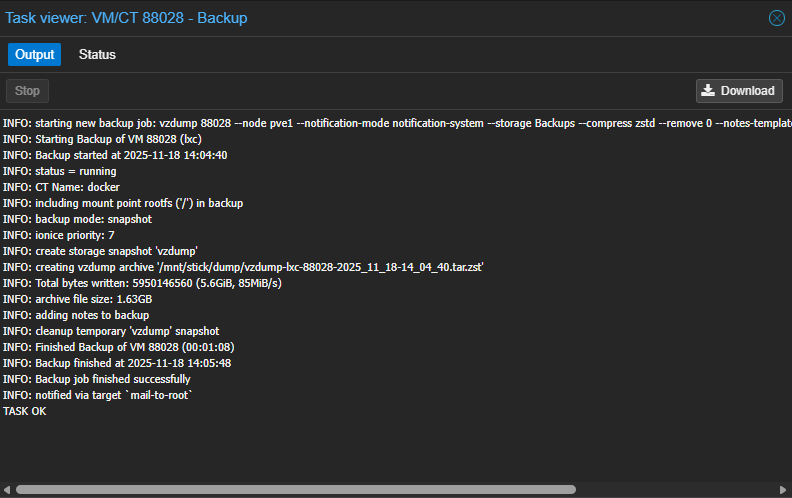

1. Backup wird angezeigt

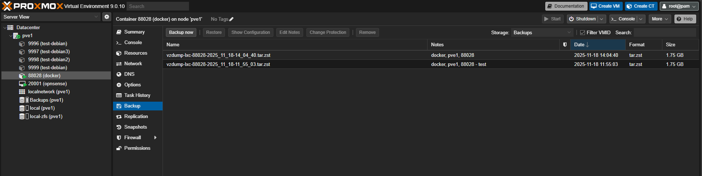

1. Shutdown

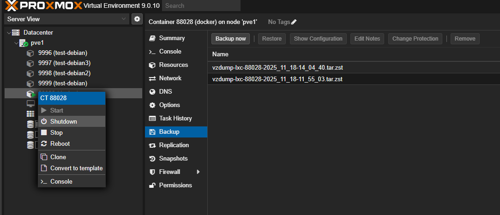

1. Delete des lxc Containers

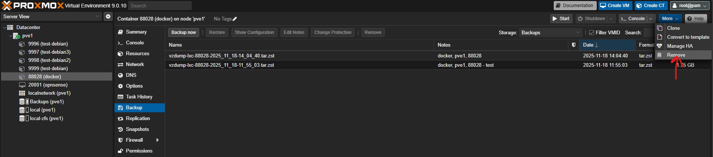

1. Bestätigung zum remove

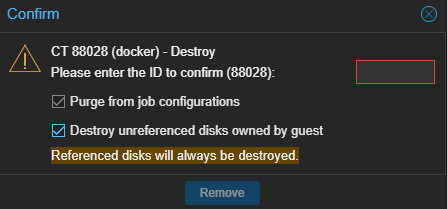

1. Eingabe ID

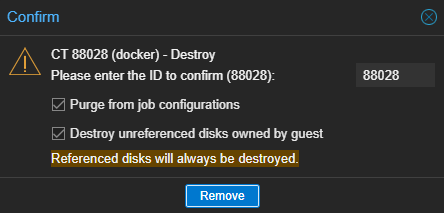

1. zu Backups gehen

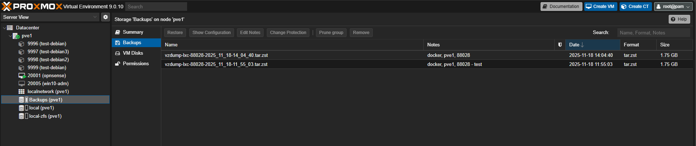

1. Backup auswählen und Restore klicken

1. CT ID eingeben 

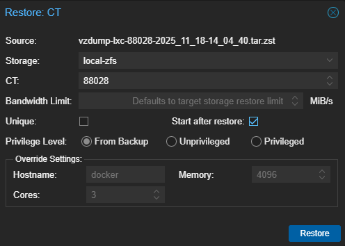

1. &#x20;Erfolgreich bei "TASK OK"

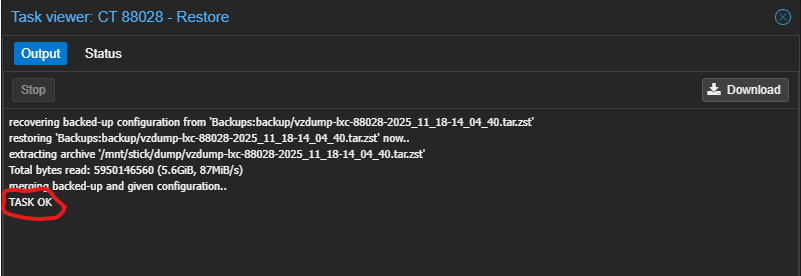

1. &#x20;Container wurde aus dem Backup wiederhergestellt

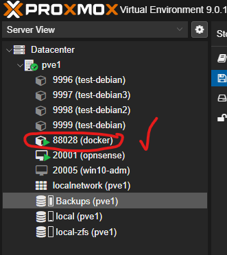

Docker checkmk sollte wieder erreichbar sein. 
