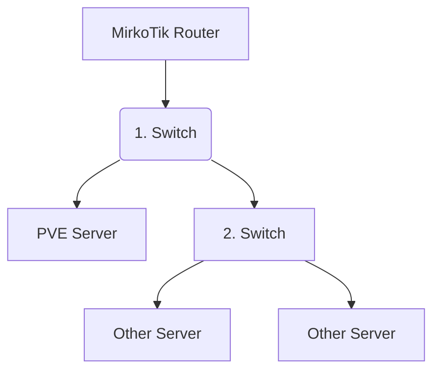

# Netzwerk

### Unsere Netzwerk Informationen und Konfiguration

Es gibt 2 Angeschlossene Netzwerk Kabel:

1. RJ45 (Ethernet)
2. SFP Port - Glasfaser 

Beide sind über einen Switch angeschlossen, der selber wiederum an dem MikroTik Router angeschlossen ist.

MikroTik -> Switch -> Server 

Interfaces  
* RJ45 = ens5f1np1 ==> vmbr0
* SFP Port = eno2 ==> vmbr6 
* vmbr7

Die Konfiguration der Netzwerk verbindung ist in: `/etc/network/interfaces`

**vmbr0** ist via DHCP bridged an das Netzwerk vom MikroTik und für jeden Erreichbar.

**vmbr6** leitet traffic in eine VM mit Opnsense weiter die als Firewall dient um ein isoliertes LAN zu simulieren und dienste geschützt darin zu hosten. Die **vmbr6** dienst als WAN aus sicht der Opnsense.

**vmbr7** dient als LAN aus sicht der Opnsense.

## Interaces Config
1. [Interface Config](./interfaces)
On system located on `/etc/network/interfaces`

#### **Rack Netzwerk Aufbau**

