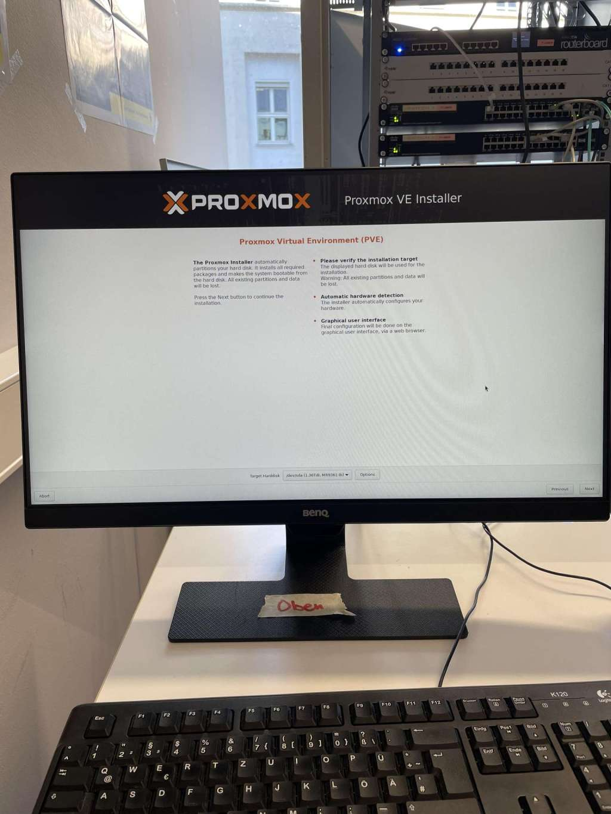
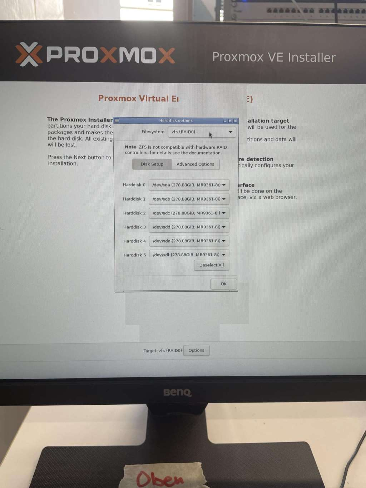
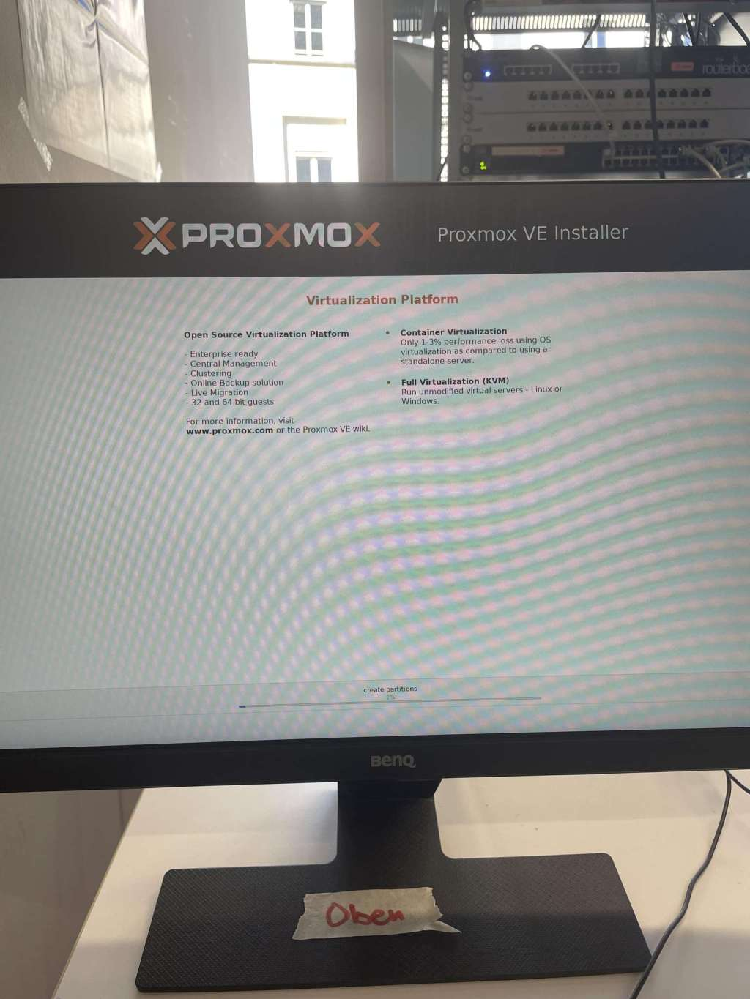
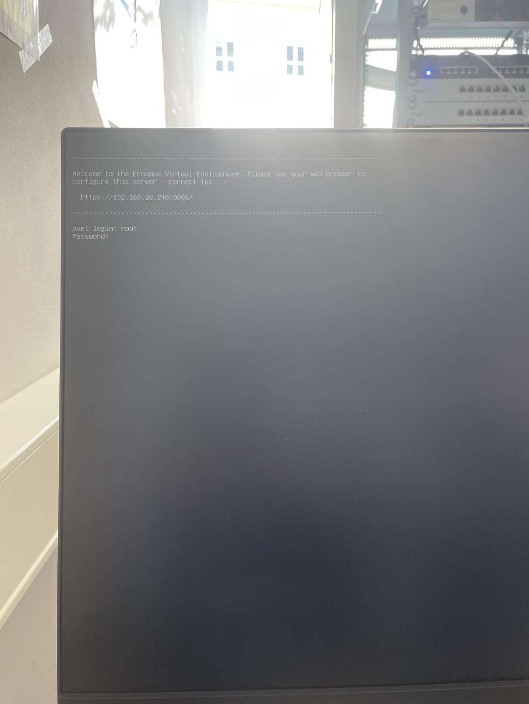

# PVE Install

# Install


&#x20;Start Proxmox auf Server 
&#x20;Definition Festplatten zfs1 (RAID 5)


&#x20;Proxmox PW: Bier123\*
&#x20;Email: labor@afbb.local
&#x20;Hostname: pve1.local 
&#x20;IP 192.168.88.240


&#x20;⁃ Install













***

## Login & Configure


&#x20;Login:

U:root

P:Bier123\*


Standardkonfiguration mit dem Internet funktioniert 


**Wichtig:**
Enterprise Repos werden deaktiviert + "no Subscription" Repo hinzufügen 
Update Proxmox 


Alias einstellen - nur nach bedarf

```shellscript
nano /etc/bash.bashrc
```
